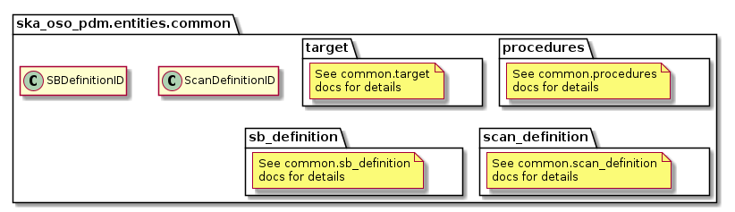

.. _entities-common:

***************************
ska_oso_pdm.entities.common
***************************

The common package contains modules and packages that model entities common to
MID and LOW Scheduling Blocks. The contents of the module are presented in the
diagram below.

   Class diagram for the __init__ module

.. automodule:: ska_oso_pdm.entities.common
    :members:
