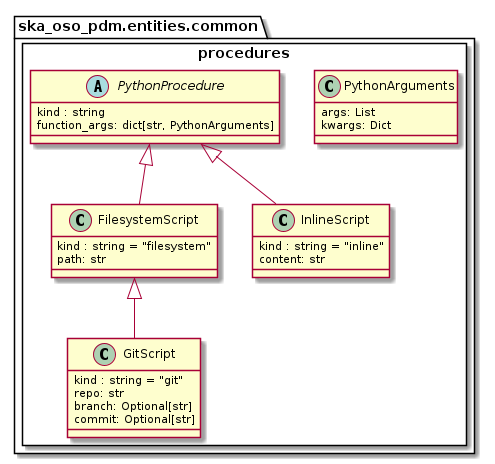

.. _entities-common-procedures:

**************************************
ska_oso_pdm.entities.common.procedures
**************************************

The procedures modules models SB entities concerned with the script execution requirements. This includes
the scripts that should process the SB and the git identifier, including the repository and branch. The
contents of the modules are presented in the diagram below.

   Class diagram for the procedure module

An example serialisation of this model to JSON is shown below.

.. code::

  # JSON modelled specifically by procedures
  ...
  "activities":{
    "allocate": {
      "procedure_type": "filesystemscript",
      "path": "/path/to/allocatescript.py",
      "function_args": {
        "init": {"args": ["posarg1","posarg2"],
          "kwargs": {"argname": "argval"}
        },
        "main": {
          "args": ["posarg1","posarg2"],
          "kwargs": {"argname": "argval"
          }
        }
      }
    },
    "observe": {
      "procedure_type": "gitscript",
      "path": "/relative/path/to/scriptinsiderepo.py",
      "repo": "https://gitlab.com/script_repo/operational_scripts",
      "branch": "main",
      "function_args": {
        "init": {"args": ["posarg1","posarg2"],
          "kwargs": {"argname": "argval"}
        },
        "main": {
          "args": ["posarg1","posarg2"],
          "kwargs": {"argname": "argval"
          }
        }
      }
    }
  }

.. automodule:: ska_oso_pdm.entities.common.procedures
    :members:
