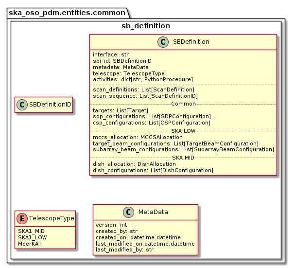

.. _entities-common-sb_definition:

*****************************************
ska_oso_pdm.entities.common.sb_definition
*****************************************

The sb_definition module models SB data model entities concerned with the
high-level composition of a Scheduling Block. An SB defines everything needed
to schedule and perform an observation, for instance:

* Target telescope
* Dish allocations to sub-arrays (for SKA MID);
* Dish configurations (receiver bands, etc., for SKA MID);
* MCCS resource allocations to sub-arrays (for SKA LOW);
* Sub-array Beam configurations (channels, antenna weights etc., for SKA LOW);
* Target Beam configuration, defining the required Target for
  subarray beam configuration (for SKA LOW);
* Targets and field positions, describing which points to observe on the sky;
* CSP (Central Signal Processing) correlator configurations to be used;
* SDHP configuration, defining the required pipeline workflows for the
  observation;
* Scan information, which describes which CSP/SDHP/dish/target configurations
  to be used for each scan;
* Scan sequence describing the sequence of scans constituting the observation.

as well as:

* SB metadata (author, creation date and version number, as well as edit history);
* SB script execution requirements;

The contents of the module are presented in the diagram below.

   Class diagram for the sb_definition module

.. code::

    # JSON modelled specifically by sb_definition
    {
      "sbd_id": "sbi-mvp01-20200325-00001",
      "telescope": "ska_mid",
      "interface": "https://schema.skao.int/ska-oso-pdm-sbd/0.1",
      "metadata": {
        "version": 1,
        "created_by": "Liz Bartlett",
        "created_on": "2022-03-28T15:43:53.971548",
        "last_modified_on": null,
        "last_modified_by": null
        }
      "activities": ...
      "dish_allocations": ...
      "csp_configurations": ...
      "dish_configurations" : ...
      "targets": ...
      "sdp_configuration": ...
      "scan_definitions": ...
      "scan_sequence": [
        "A", "B", "B", "A"
      ]
    }

.. automodule:: ska_oso_pdm.entities.common.sb_definition
    :members:
