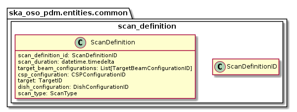

.. _entities-common-scan_definition:

*******************************************
ska_oso_pdm.entities.common.scan_definition
*******************************************

The scan_definition module models SB entities concerned with the selection of
which element configurations should take effect for the duration of a scan.
The contents of the module are presented in the diagram below.

   Class diagram for the scan_definition module

An example serialisation of this model to JSON for SKA MID is shown below.

.. code::

  # JSON modelled specifically by scan_definition
  ...
  "scan_definitions": [
    {
      "scan_definition_id": "calibrator scan",
      "scan_duration": 60000,
      "target": "calibrator target",
      "dish_configuration": "dish config 123",
      "scan_type": "calibration_B",
      "csp_configuration": "csp-mvp01-20220329-00001"
    },
    {
      "scan_duration": 60000,
      "target": "science target",
      "dish_configuration": "dish config 123",
      "scan_type": "science_A",
      "scan_definition_id": "science scan"
    }
  ],

A JSON code example for SKA LOW is shown below.

.. code::

  # JSON modelled specifically by scan_definition

  "scan_definitions": [
    {
      "scan_definition_id": "sbi-mvp01-20220328-00001",
      "scan_duration": 64000,
      "target_beam_configurations": [
        "target #1 with beam A config 1"
      ],

.. automodule:: ska_oso_pdm.entities.common.scan_definition
    :members:
