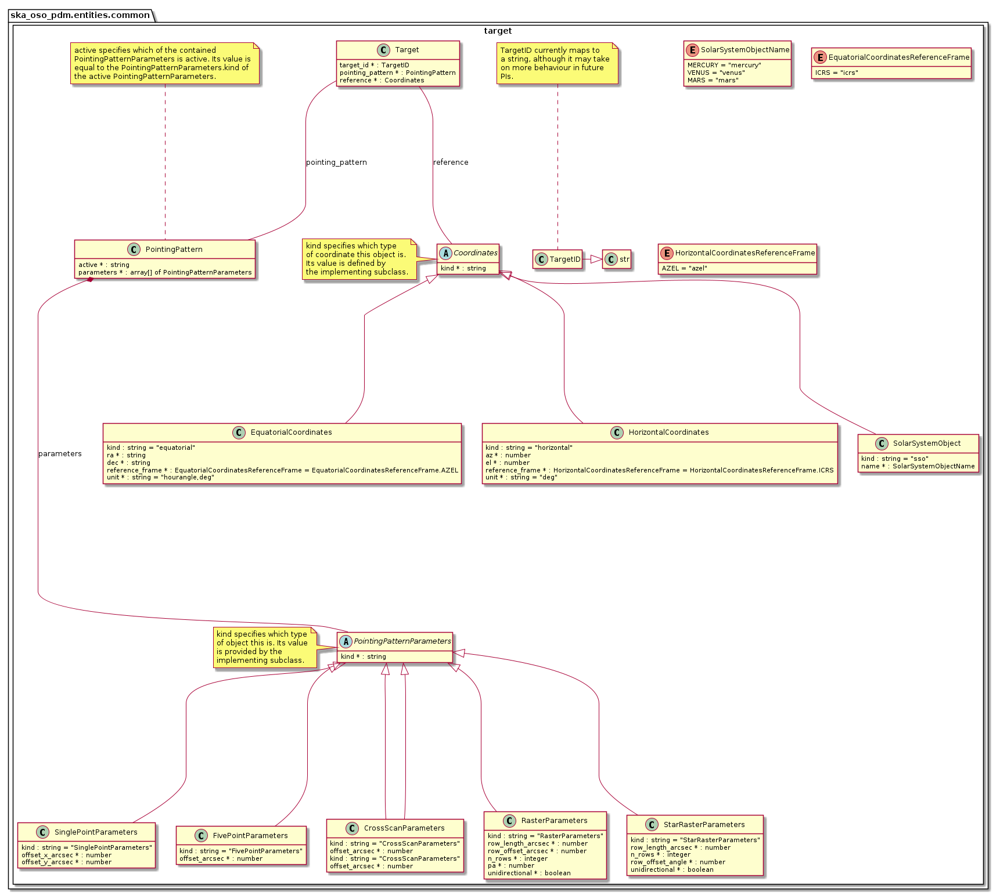

.. _entities-common-target:

**********************************
ska_oso_pdm.entities.common.target
**********************************

The target module models entities concerned with
receptor pointing and mapping (source coordinates, survey fields,
pointing patterns, etc.). The contents of the module are presented
in the diagram below.

   Class diagram for the target module

An example serialisation of this model to JSON is shown below. This
describes two target objects: one, a five-point observation centred
on Polaris Australis using 5 arcsec offsets between individual pointings,
and two, a single pointing observation centred on M83. In both cases,
the coordinates are defined using equatorial coordinates using an ICRS
reference frame.

.. code::

  # JSON modelled specifically by target module
  ...
  "targets": [
    {
      "target_id": "Polaris Australis",
      "pointing_pattern": {
        "active": "FivePointParameters",
        "parameters": [
          {
            "kind": "FivePointParameters",
            "offset_arcsec": 5.0
          }
        ]
      },
      "reference_coordinate": {
        "kind": "equatorial",
        "ra": "21:08:47.92",
        "dec": "-88:57:22.9",
        "reference_frame": "ICRS",
        "unit": ["hourangle","deg"]
      }
    },
    {
      "target_id": "M83",
      "pointing_pattern": {
        "active": "SinglePointParameters",
        "parameters": [
          {
            "kind": "SinglePointParameters",
            "offset_x_arcsec": 0.0,
            "offset_y_arcsec": 0.0
          }
        ]
      },
      "reference_coordinate": {
        "kind": "equatorial",
        "ra": "13:37:00.919",
        "dec": "-29:51:56.74",
        "reference_frame": "ICRS",
        "unit": ["hourangle","deg"]
      }
    }
  ],
  ...

Another JSON example defining one drift scan target with position specified
as azimuth and elevation is shown below.

.. code::

  ...
  "targets": [
    {
      "target_id": "target #1",
      "pointing_pattern": {
        "active": "SinglePointParameters",
        "parameters": [
          {
            "kind": "SinglePointParameters",
            "offset_x_arcsec": 0.0,
            "offset_y_arcsec": 0.0
          }
        ]
      },
      "reference_coordinate": {
        "kind": "horizontal",
        "az": 180.0,
        "el": 45.0,
        "reference_frame": "ALTAZ",
        "unit": ["hourangle","deg"]
      }
    }
  ],
  ...

.. automodule:: ska_oso_pdm.entities.common.target
    :members:
