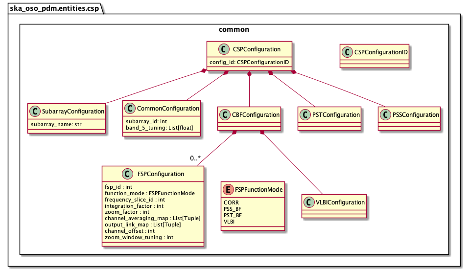

.. _entities-csp-common:

******************************************
ska_oso_pdm.entities.csp.common
******************************************

The csp.common module models SB entities concerned with CSP (Central
Signal Processing) beam former and correlator configuration. The contents of
the module are presented in the diagram below.

   Class diagram for the common module within csp

An example serialisation of this model to JSON is shown below.

.. code::

    # JSON modelled specifically by csp_configuration
    ...
  "csp_configurations": [{
      "config_id": "csp-mvp01-20220329-00001",
      "subarray": {"subarray_name": "science period 23"},
      "common": {
        "subarray_id": 1,
        "band_5_tuning": [5.85,7.25]
      },
      "cbf": {
        "fsp": [{
            "fsp_id": 1,
            "function_mode": "CORR",
            "frequency_slice_id": 1,
            "integration_factor": 1,
            "zoom_factor": 0,
            "channel_averaging_map": [[0,2],[744,0]],
            "channel_offset": 0,
            "output_link_map": [[0,0],[200,1]]
          },
          {
            "fsp_id": 2,
            "function_mode": "CORR",
            "frequency_slice_id": 2,
            "integration_factor": 1,
            "zoom_factor": 1,
            "zoom_window_tuning": 650000
          }]
      }
    }
  ],
    ...

.. automodule:: ska_oso_pdm.entities.csp.common
    :members:
