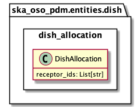

.. _entities-dish-dish_allocation:

*****************************************
ska_oso_pdm.entities.dish.dish_allocation
*****************************************

The dish_allocation module defines which SKA MID dishes should be allocated to
a sub-array prior to an observation.

   Class diagram for the dish_allocation module

An example serialisation of this model to JSON is shown below.

.. code::

   # JSON modelled specifically by dish_allocation
   ...
   "dish_allocations": {
      "receptor_ids": ["0001","0002"]
   },
   ...

.. automodule:: ska_oso_pdm.entities.dish.dish_allocation
    :members:
