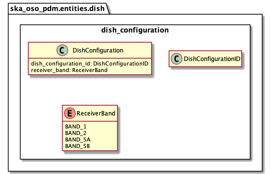

.. _entities-dish-dish_configuration:

********************************************
ska_oso_pdm.entities.dish.dish_configuration
********************************************

The dish_configuration module models SB entities concerned with SKA MID dish
configuration.

   Class diagram for the dish_configuration module

An example serialisation of this model to JSON is shown below.

.. code::

   # JSON modelled specifically by dish_configuration
   ...
  "dish_configurations" : [
      {
          "dish_configuration_id": "dci_mvp01-20220329-00001",
          "receiver_band" : "1"
      }
  ],
  ...

.. automodule:: ska_oso_pdm.entities.dish.dish_configuration
    :members:
