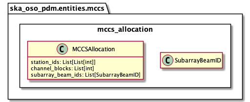

.. _entities-mccs-mccs_allocation:

*****************************************
ska_oso_pdm.entities.mccs.mccs_allocation
*****************************************

The mccs_allocation module defines which SKA LOW stations should be allocated to
a sub-array beam prior to an observation.

   Class diagram for the mccs_allocation module

An example serialisation of this model to JSON is shown below.

.. code::

   # JSON modelled specifically by mccs_allocation
   ...
   "mccs_allocation": {
      "subarray_beam_ids": ["Beam A"],
      "station_ids": [[1,2]],
      "channel_blocks": [3]
   },
   ...

.. automodule:: ska_oso_pdm.entities.mccs.mccs_allocation
    :members:
