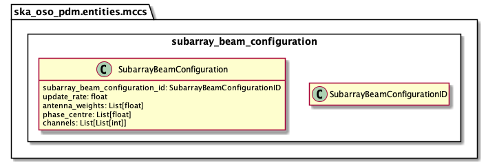

.. _entities-mccs-subarray_beam_configuration:

****************************************************
ska_oso_pdm.entities.mccs.subarray_beam_configuration
****************************************************

The subarray_beam_configuration module models SKA LOW SB entities.
The contents of the module are presented in the diagram below.

   Class diagram for the subarray_beam_configuration module

An example serialisation of this model to JSON is shown below.

.. code::

  # JSON modelled specifically by subarray_beam_configuration
  ...
  "subarray_beam_configuration": {
      "subarray_beam_configuration_id": "Beam A config 1",
      "subarray_beam_id": "Beam A",
      "update_rate": 0.0,
      "antenna_weights": [1.0, 1.0, 1.0],
      "phase_centre": [0.0, 0.0],
      "channels": [
        [0, 8, 1, 1],
        [8, 8, 2, 1],
        [24, 16, 2, 1]
      ]
  },
  ...

.. automodule:: ska_oso_pdm.entities.mccs.subarray_beam_configuration
    :members:
