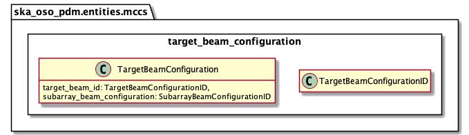

.. _entities-mccs-target_beam_configuration:

**************************************************
ska_oso_pdm.entities.low.target_beam_configuration
**************************************************

The target_beam_configuration module defines which SKA LOW target will be mapped
to the subarray beam configurations.

   Class diagram for the target_beam_configuration module

An example serialisation of this model to JSON is shown below.

.. code::

   # JSON modelled specifically by target_beam_configuration
   ...
   "target_beam_configurations": [
      {
          "target_beam_id": "science target beam",
          "target": "my science target",
          "subarray_beam_configuration": "subarray beam 1"
      }
   ],
   ...

.. automodule:: ska_oso_pdm.entities.mccs.target_beam_configuration
    :members:
