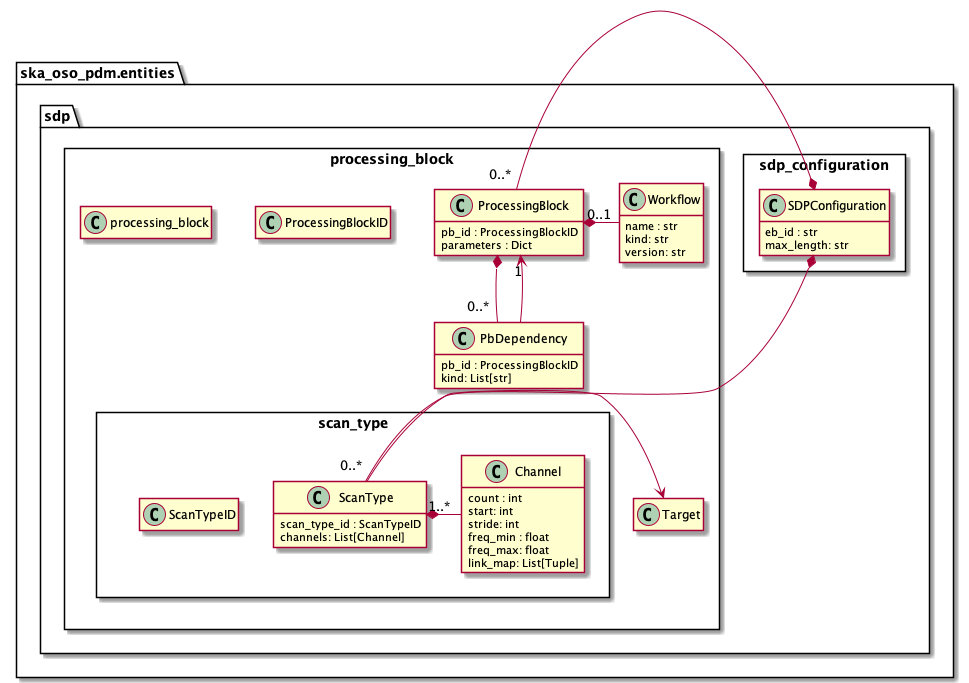

.. _entities-sdp-sdp_configuration:

*******************************
ska_oso_pdm.entities.sdp
*******************************

The sdp package contains modules that model SB entities concerned with SDHP
resource allocation and pipeline workflow configuration. The contents of the
module are presented in the diagram below.

   Class diagram for the sdp package

An example serialisation of this model to JSON is shown below.

.. code::

  # JSON modelled specifically by entities in the sdp package
  ...
  "sdp_configuration": {
    "eb_id": "eb-mvp01-20200325-00001",
    "max_length": 100.0,
    "scan_types": [{
        "scan_type_id": "science_A",
        "target": "my science target",
        "channels": [{
            "count": 744,
            "start": 0,
            "stride": 2,
            "freq_min": 0.35e9,
            "freq_max": 0.368e9,
            "link_map": [[0,0],[200,1],[744,2],[944,3]]
          },
          {
            "count": 744,
            "start": 2000,
            "stride": 1,
            "freq_min": 0.36e9,
            "freq_max": 0.368e9,
            "link_map": [[2000,4],[2200,5]]
            }]},
      {
        "scan_type_id": "calibration_B",
        "target": "my calibrator target",
        "channels": [{
            "count": 744,
            "start": 0,
            "stride": 2,
            "freq_min": 0.35e9,
            "freq_max": 0.368e9,
            "link_map": [[0,0],[200,1],[744,2],[944,3]]
          },
          {
            "count": 744,
            "start": 2000,
            "stride": 1,
            "freq_min": 0.36e9,
            "freq_max": 0.368e9,
            "link_map": [[2000,4],[2200,5]]
          }]}],
    "processing_blocks": [{
        "pb_id": "pb-mvp01-20200325-00001",
        "workflow": {
          "name": "vis_receive",
          "kind": "realtime",
          "version": "0.1.0"
        },
        "parameters": {}
      },
      {
        "pb_id": "pb-mvp01-20200325-00002",
        "workflow": {
          "name": "test_receive_addresses",
          "kind": "realtime",
          "version": "0.3.2"
        },
        "parameters": {}
      },
      {
        "pb_id": "pb-mvp01-20200325-00003",
        "workflow": {
          "name": "ical",
          "kind": "batch",
          "version": "0.1.0"
        },
        "parameters": {},
        "dependencies": [{
            "pb_id": "pb-mvp01-20200325-00001",
            "kind": ["visibilities"]
          }]
      },
      {
        "pb_id": "pb-mvp01-20200325-00004",
        "workflow": {
          "name": "dpreb",
          "kind": "batch",
          "version": "0.1.0"
        },
        "parameters": {},
        "dependencies": [{
            "kind": ["calibration"],
            "pb_id": "pb-mvp01-20200325-00003"
          }]
      }
    ]
  },

  "sdpConfiguration": {
    "eb_id": "eb-mvp01-20200325-00001",
    "max_length": 100.0,
    "scan_types": [
      {
        "scan_type_id": "science_A",
        "target": "beam #1",
        "channels": [{
           "count": 744, "start": 0, "stride": 2,
           "freq_min": 0.35e9,
           "freq_max": 0.368e9,
           "link_map": [[0, 0], [200, 1], [744, 2], [944, 3]]
         },
         {
           "count": 744, "start": 2000, "stride": 1,
           "freq_min": 0.36e9,
           "freq_max": 0.368e9,
           "link_map": [[2000, 4], [2200, 5]]
         }]
      },
      {
        "scan_type_id": "calibration_B",
        "target": "bandpass calibrator",
        "channels": [{
          "count": 744, "start": 0, "stride": 2,
          "freq_min": 0.35e9,
          "freq_max": 0.368e9,
          "link_map": [[0, 0], [200, 1], [744, 2], [944, 3]]
        },
        {
          "count": 744, "start": 2000, "stride": 1,
          "freq_min": 0.36e9,
          "freq_max": 0.368e9,
          "link_map": [[2000, 4], [2200, 5]]
        }]
      }
    ],
    "processing_blocks": [
      {
        "pb_id": "pb-mvp01-20200325-00001",
        "workflow": {"name": "vis_receive", "kind": "realtime", "version": "0.1.0"},
        "parameters": {}
      },
      {
        "pb_id": "pb-mvp01-20200325-00003",
        "workflow": {"name": "ical", "kind": "batch", "version": "0.1.0"},
        "parameters": {},
        "dependencies": [
          {"pb_id": "pb-mvp01-20200325-00001", "kind": ["visibilities"]}
        ]
      }
    ]
  },
  ...

.. automodule:: ska_oso_pdm.entities.sdp.sdp_configuration
    :members:

.. automodule:: ska_oso_pdm.entities.sdp.scan_type
    :members:

.. automodule:: ska_oso_pdm.entities.sdp.processing_block
    :members:
