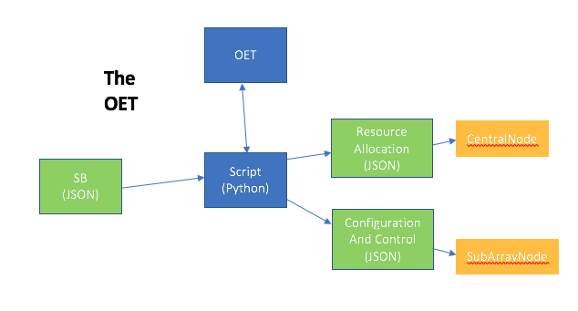

==========
Background
==========

The SKA Project Data Model (PDM) defines a logical data model with
entities and relationships that represent all the information required to
schedule and observe a fully calibratable observation on an SKA telescope.

Currently, the sole consumer of this library is the Observation Execution
Tool (OET), the application which provides high-level scripting facilities
and a high-level scripting UI for the SKA. The Python scripts run by the OET
convert Scheduling Blocks, as modelled by this library, into Configuration
Data Model (CDM) JSON payloads that configure and control the telescope.

Context
=======

The implementation context is as follows: a design has been developed for
the SKA Project Data Model (SPDM); the Minimum Viable Product (MVP) provides
simulated implementations of all important SKA systems; a working
version of the Observation Execution Tool (OET) is available.

In operation, the OET will be given a Scheduling Block (SB), the atomic
unit of an observing program, and will run a script to execute it at the
telescope.

The script executed under the OET will, among other things, parse the SB
JSON and split the information into the Configuration Data Model (CDM)
JSON components required to configure the telescope.
