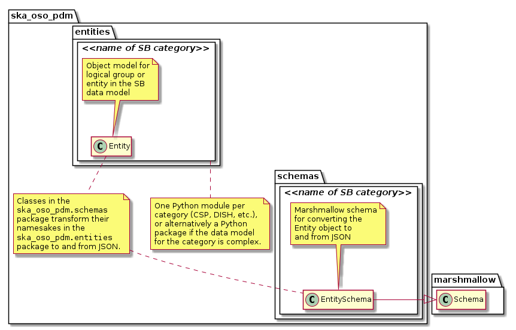
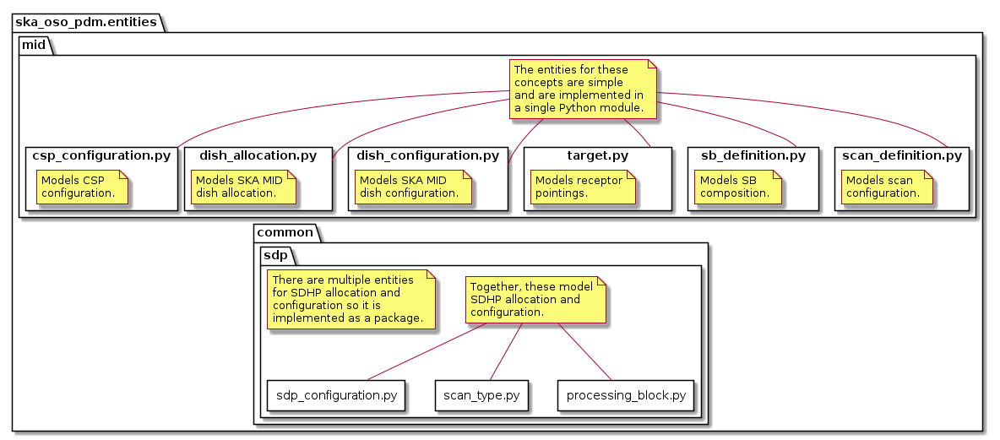
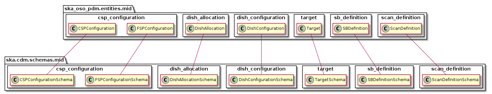
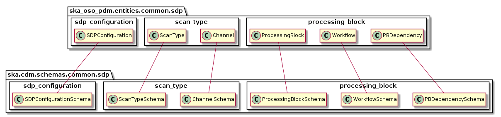

==============
Project layout
==============

The PDM project contains two top-level packages, ``ska_oso_pdm.entities`` and
``ska_oso_pdm.schemas`` as shown in the figure below. The ``ska_oso_pdm.entities``
package contains Python object models for the logical entities in the SB
data model. The ``ska_oso_pdm.schemas`` package contains code to transform the
classes defined in ``ska_oso_pdm.entities`` to and from JSON.

   Project layout and naming conventions.

The project layout and naming conventions are:

* The SB data model is divided into logical groups that collect
  related entities together.
* For each SB entity grouping, a corresponding Python module is
  created in ``ska_oso_pdm.entities`` and ``ska_oso_pdm.schemas``. If the
  grouping is complex and contains many entities, the modules may
  be located inside a dedicated package for the group.
* Python classes representing the SB data model entities are found
  in the corresponding ``ska_oso_pdm.entities`` module/package.
* Marshmallow schema to transform ``ska_oso_pdm.entities`` objects to and
  from JSON are found in ``ska_oso_pdm.schemas``.

Entities overview
-----------------

   Overview of PDM entities

The Python object model for the entities defined in the SB data model are
located in the ``ska_oso_pdm.entities`` package. In general, each SB entity is
represented as a Python class and each entity attribute presented as a class
attribute or property.

PDM attributes can be typed as plain Python data types (strings, floats, etc.)
or, where appropriate, represented by rich objects if this provides additional
value to the client. For example, while astronomical coordinates are
represented by floats and strings in the JSON schema, in the object model they
are defined as Astropy
`SkyCoord <https://docs.astropy.org/en/stable/api/astropy.coordinates.SkyCoord.html>`_
instances to ensure ensure correct coordinate handling and permit easier
manipulation downstream. Similarly, quantities with units could be defined as
instances of Astropy
`Quantity <https://docs.astropy.org/en/stable/units/quantity.html>`_ to
provide additional functionality.

For details on the entities modelled by this library, see the pages within
the API documentation.

Schemas overview
----------------

Classes to marshall the ``ska_oso_pdm.messages`` objects to and from JSON are
defined in the ``ska_oso_pdm.schemas`` package. This project uses
`Marshmallow <http://marshmallow.org>`_ for JSON serialisation. Classes
in the ``ska_oso_pdm.schemas`` define Marshmallow schemas which are used by
Marshmallow during JSON conversion.

   Schema mapping for ska_oso_pdm.entities package

   Schema mapping for ska_oso_pdm.entities.sdp package
